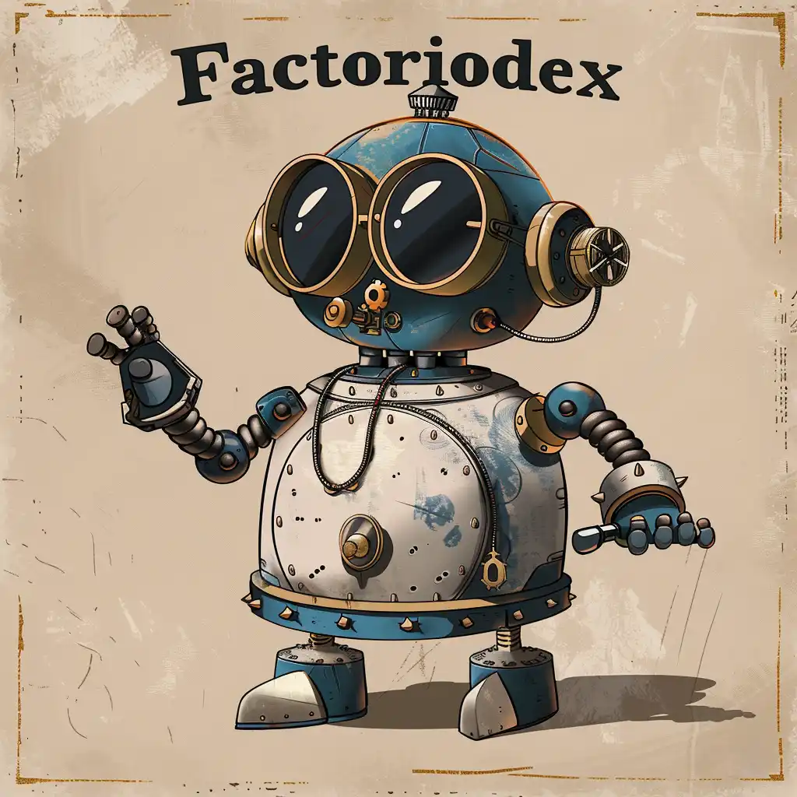

<a name="readme-top"></a>


## Factoriodex is currently offline and will be back up May 1st, PDT.


<!-- PROJECT LOGO -->
<br />
<div align="center">
  <a href="https://github.com/Eric-Lighthall/factoriodex">
    
  </a>

<h3 align="center">Factoriodex</h3>

  <p align="center">
    Factoriodex is a streamlined API delivering essential data on Factorio items, enemies, and research, powered by Node.js and MongoDB for developers and gamers.
    <br />
    <br />
    <br />
    <a href="https://factoriodex.cyclic.app/">Live Site</a>
    ·
    <a href="https://github.com/Eric-Lighthall/factoriodex/issues/new?labels=bug&template=bug-report---.md">Report Bug</a>
    ·
    <a href="https://github.com/Eric-Lighthall/factoriodex/issues/new?labels=enhancement&template=feature-request---.md">Request Feature</a>
  </p>
</div>


<!-- DISCLAIMER -->
## Disclaimer
Factoriodex is not affiliated with or endorsed by Factorio or its creators.


<!-- ABOUT THE PROJECT -->
## About The Project
Factoriodex is a curated API by Eric Lighthall, offering detailed Factorio data on items, enemies, and research. It is crafted with Node.js and MongoDB and hosted seamlessly on Cyclic.sh. Accompanying the API is a static site documenting its use, built with vanilla HTML and CSS for clarity and ease of access.


### Built With

* [![Node][Node.js]][Node-url]
* [![Express][Express.js]][Express-url]
* [![Javascript][Javascript]][Javascript-url]
* [![MongoDB][MongoDB]][Mongo-url]
* [![HTML5][HTML5]][HTML-url]
* [![CSS3][CSS3]][CSS-url]


<!-- GETTING STARTED -->
## Getting Started

Factoriodex can be found on https://factoriodex.cyclic.app/. 

Factoriodex fully supports CORS so no API keys are needed. You can start using factoriodex right away on your own projects!

<!-- USAGE EXAMPLES -->
## Usage

The base URL for the API can be accessed with https://factoriodex.cyclic.app/api/. To make a valid request, you need to append an endpoint to the base URL and include query parameters as needed.

The following endpoints are accessible
  ```http
  GET https://factoriodex.cyclic.app/api/enemies
  ```

  ```http
  GET https://factoriodex.cyclic.app/api/items
  ```

  ```http
  GET https://factoriodex.cyclic.app/api/research
  ```

  ## Example Request 
   ```js
   // Javascript
   fetch('/api/items?name=armor&type=combat')
    .then(response => response.json())
    .then(data => console.log(data))
    .catch(error => console.error(error));
   ```


<!-- CONTRIBUTING -->
## Contributing

Contributions are what make the open source community such an amazing place to learn, inspire, and create. Any contributions you make are **greatly appreciated**.

If you have a suggestion that would make this better, please fork the repo and create a pull request. You can also simply open an issue with the tag "enhancement".

1. Fork the Project
2. Create your Feature Branch (`git checkout -b feature/AmazingFeature`)
3. Commit your Changes (`git commit -m 'Add some AmazingFeature'`)
4. Push to the Branch (`git push origin feature/AmazingFeature`)
5. Open a Pull Request


<!-- LICENSE -->
## License

Distributed under the MIT License. See `LICENSE.txt` for more information.


<!-- CONTACT -->
## Contact

[@EricLighthall](https://twitter.com/EricLighthall) - ericlighthall2@gmail.com - [ericlighthall.com](https://ericlighthall.com)

[https://github.com/Eric-Lighthall/factoriodex](https://github.com/Eric-Lighthall/factoriodex)


<p align="center"><a href="#readme-top">back to top</a></p>

<!-- MARKDOWN LINKS & IMAGES -->
[Node.js]: https://img.shields.io/badge/Node.js-43853D?style=for-the-badge&logo=node.js&logoColor=white
[Node-url]: https://nodejs.org/
[Express.js]: https://img.shields.io/badge/Express.js-404D59?style=for-the-badge
[Express-url]: https://expressjs.com/
[MongoDB]: https://img.shields.io/badge/MongoDB-4EA94B?style=for-the-badge&logo=mongodb&logoColor=white
[Mongo-url]: https://www.mongodb.com/
[Javascript]: https://img.shields.io/badge/JavaScript-F7DF1E?style=for-the-badge&logo=javascript&logoColor=black
[Javascript-url]: https://www.javascript.com/
[HTML5]: https://img.shields.io/badge/HTML-239120?style=for-the-badge&logo=html5&logoColor=white
[HTML-url]: https://html5.org/
[CSS3]: https://img.shields.io/badge/CSS3-1572B6?style=for-the-badge&logo=css3&logoColor=white
[CSS-url]: https://angular.io/
